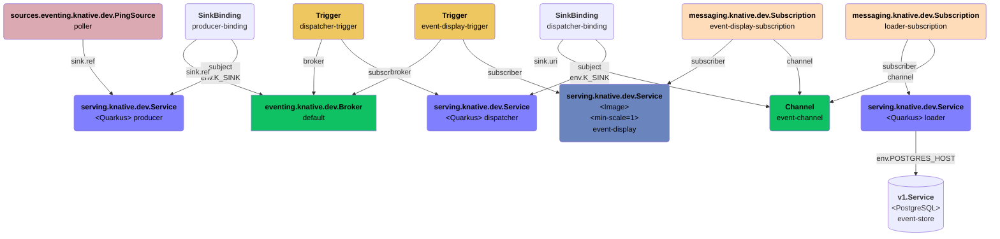

# knative-quickstarts
Generate, display and store recurring events (polyglot)

## Sample architecture
Deployment architecture of the demo application:


Configured event flow:
```mermaid
graph TD
   poller(<b>sources.eventing.knative.dev.PingSource</b><br/>poller)
   style poller fill:#dba9b2,color:#000;
   producer(<b>serving.knative.dev.Service</b><br/>producer)
   broker[<b>eventing.knative.dev.Broker</b><br/>default]
   poller -.type: dev.knative.sources.ping.-> producer
   producer -.type: com.redhat.knative.demo.Produced.-> broker
   style producer fill:#8080ff,color:#000;

   dispatcher(<b>serving.knative.dev.Service</b><br/>dispatcher)
   event-channel(<b>Channel</b><br/>event-channel)
   broker -.type: com.redhat.knative.demo.Produced.-> dispatcher
   style broker fill:#0fc163,color:#000;
   dispatcher -.type: com.redhat.knative.demo.Dispatched.-> event-channel
   style dispatcher fill:#8080ff,color:#000;

   loader(<b>serving.knative.dev.Service</b><br/>loader)
   event-channel -.type: com.redhat.knative.demo.Dispatched.-> loader

   event-display(<b>serving.knative.dev.Service</b><br/>event-display)
   style event-display fill:#dba9b2,color:#000;
   broker -.type: com.redhat.knative.demo.Produced.-> event-display
   event-channel -.type: com.redhat.knative.demo.Dispatched.-> event-display
   style event-channel fill:#0fc163,color:#000;

   event-store[(<b>v1.Service</b><br/>event-store)]
   loader -.type: com.redhat.knative.demo.Loaded.->event-store
   style loader fill:#8080ff,color:#000;
```
## Installing the application
We'll install the application on the [OpenShift Sandbox](https://developers.redhat.com/developer-sandbox), that already includes an
instance of the `Red Hat OpenShift Serverless` operator.

```bash
export APP_NAMESPACE=<YOUR_NS>
export IMAGE_NAMESPACE=<YOUR_NS>
export DB_NAMESPACE=<YOUR_NS>
oc project ${APP_NAMESPACE}
oc new-app --name=postgresql --template=postgresql-ephemeral \
   -e POSTGRESQL_USER=demo -e POSTGRESQL_PASSWORD=demo123 -e POSTGRESQL_DATABASE=demodb\
   -e NAMESPACE=${DB_NAMESPACE}
oc process -p=APP_NAMESPACE=${APP_NAMESPACE} -f config/infra | oc apply -f -
oc process -p=IMAGE_NAMESPACE=${IMAGE_NAMESPACE} -f config/build | oc apply -f -
oc process -p=APP_NAMESPACE=${APP_NAMESPACE} -f config/app | oc apply -f -
```

Commands to monitor the applications or the CloudEvents:
```bash
oc logs -f -l app=knative-quickstarts-demo -c knative-quickstarts-demo-app
oc logs -f -l module=event-display -c user-container
```

Commands to check the DB status:
```bash
PSQL_POD=$(oc get pod -l name=postgresql -oname) && oc exec ${PSQL_POD} -- psql -Udemo -h localhost demodb -c "/dt" 
PSQL_POD=$(oc get pod -l name=postgresql -oname) && oc exec ${PSQL_POD} -- psql -Udemo -h localhost demodb -c "select * from loadedrecord" 
```

Sample commands to update the configuration of the Knative services (require `kn` Knative CLI):
```bash
kn service update producer-python --scale-min=0
kn service update producer-python --traffic @latest=100
```

## Uninstalling the application
```bash
oc process -p=APP_NAMESPACE=${APP_NAMESPACE} -f config/infra | oc delete -f -
oc process -p=IMAGE_NAMESPACE=${IMAGE_NAMESPACE} -f config/build | oc delete -f -
oc process -p=APP_NAMESPACE=${APP_NAMESPACE} -f config/app | oc delete -f -

oc delete dc/postgresql 
oc delete svc/postgresql 
```
