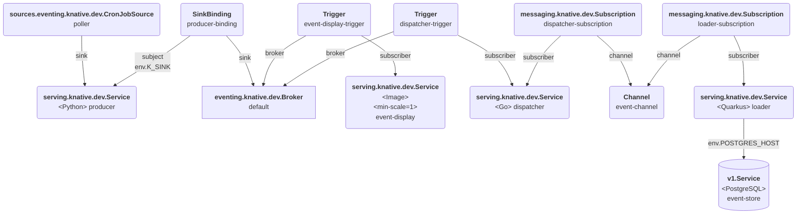

# knative-quickstarts

## Sample architecture

```mermaid
graph TD
   poller(<b>sources.eventing.knative.dev.CronJobSource</b><br/>poller)
   producer(<b>serving.knative.dev.Service</b><br/>&ltPython&gt producer)
   producer-binding(<b>SinkBinding</b><br/>producer-binding)
   broker[<b>eventing.knative.dev.Broker</b><br/>default]
   poller --sink--> producer
   producer-binding --subject<br/>env.K_SINK--> producer
   producer-binding --sink--> broker

   event-display(<b>serving.knative.dev.Service</b><br/>&ltImage&gt<br/>&ltmin-scale=1&gt<br/>event-display)
   event-display-trigger(<b>Trigger</b><br/>event-display-trigger)
   event-display-trigger --subscriber--> event-display
   event-display-trigger --broker--> broker

   dispatcher(<b>serving.knative.dev.Service</b><br/>&ltGo&gt dispatcher)
   dispatcher-trigger(<b>Trigger</b><br/>dispatcher-trigger)
   dispatcher-trigger --subscriber--> dispatcher
   dispatcher-trigger --broker--> broker

   event-channel(<b>Channel</b><br/>event-channel)
   dispatcher-subscription(<b>messaging.knative.dev.Subscription</b><br/>dispatcher-subscription)
   dispatcher-subscription --channel--> event-channel
   dispatcher-subscription --subscriber--> dispatcher

   loader(<b>serving.knative.dev.Service</b><br/>&ltQuarkus&gt loader)
   loader-subscription(<b>messaging.knative.dev.Subscription</b><br/>loader-subscription)
   loader-subscription --channel--> event-channel
   loader-subscription --subscriber--> loader

   event-store[(<b>v1.Service</b><br/>&ltPostgreSQL&gt<br/>event-store)]
   loader --env.POSTGRES_HOST-->event-store
```